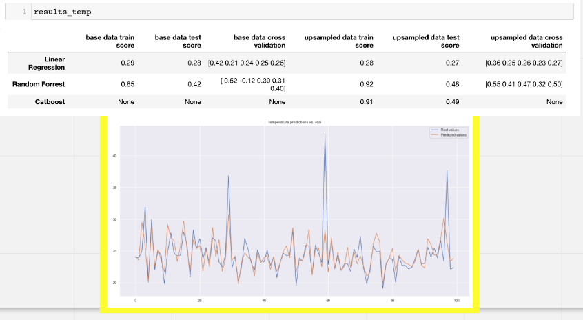
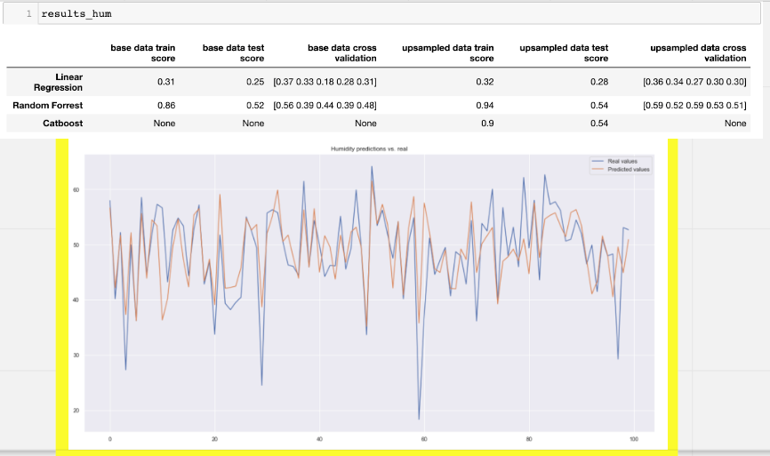

# Forecasting Sensor Data
Plant growth and health is heavily influenced by humidity, temperature, light and CO2 levels. I want to be able to predict these values, so that I can take informed preventive decisions to take care of my plants. In this project, I want to know if I can predict these variables only by using the local weather forecast:

#### Can outdoors weather data be used to predict indoors temperature, humidty, light, and CO2 levels? 

 # The data: 
I needed to collect two sets of data: indoor data (as my labels) and outdoors data (as my features).
- To get this indoor data, I used Mimir which is hardware created by Lloyd Richards and sends readings of sensor data to a cloud-hosted Firebase Realtime Database, from which I collected the data. The device is simply positionned in any room, near a plant, or where one would want to put a plant. 
- For the outdoors data I used the Openweather api for the location of Zurich (where the device is located). I both collected historical data but also used another api endpoint for weather forecast.

# The methodology
- data cleaning: a good amount of data wraggling was necesary (see jupter notebook)
- linear regression, decision trees, and gradient descent comparison for all variable (temperature, humidity, light, and CO2)

# The results
- I am able to predict the sensor readings for temperature and humidity in an acceptable way but am not able to predict the other variables. 

# Usage
- make sure you can use Jupyter Notebooks
- git clone 
- pip install -r requirements.txt
- run the notebook 

# Keywords
Firebase, Linear Regression, Decision Tree, Random Forrest, Gradient Descent, Catboost, requests, openweather api.

# Credits
[Lloyd Richard](https://github.com/lloydrichards), and all the mimir team
